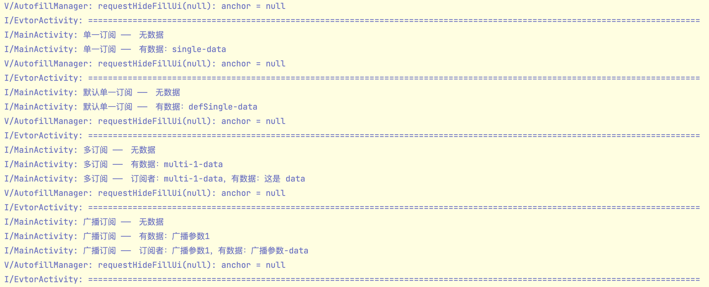

# Evtor


>   一个简洁的事件总线框架。能订阅特定事件和广播事件，数据传递等。
>
>   比[`ObsEvent`](https://github.com/yhyzgn/ObsEvent.git)便捷，不用实现接口，秩序简单的注解订阅就能接收到事件。

### 效果图

>   以下简单地用`Log`展示了下效果



### 功能简介

*   指定事件订阅者
*   向特定的订阅者发送事件
*   发送事件能传递数据
*   能同时订阅多个事件
*   定义广播事件

### 使用方法

*   在`dependencies`中添加依赖

    ```groovy
    dependencies {
        implementation 'com.yhy.event:evtor:latestVersion'
    }
    ```

*   注册和注销观察者

    >   可以是任何类，这里以`Activity`为例

    ```java
    public class MainActivity extends AppCompatActivity {
        @Override
        protected void onCreate(Bundle savedInstanceState) {
            super.onCreate(savedInstanceState);
            setContentView(R.layout.activity_main);
            // 注册观察者
            Evtor.evtor().observe(this);
        }
    
        @Override
        protected void onDestroy() {
            super.onDestroy();
            // 注销观察者
            Evtor.evtor().cancel(this);
        }
    }
    ```

*   在观察者中订阅事件

    >   订阅形式多种多样，以下一一举例

    *   单订阅者

        >   指定一个订阅者名称，发送事件时直接发送到该订阅者上，也只能接受该名称的事件
        >
        >   **单订阅者最多接收一个参数**
        >
        >   **如果触发事件时未传递任何数据，只会触发空参数的同名订阅者；否则将触发所有同名订阅者**

        ```java
        // 订阅者名称为“single”，不接收任何数据
        @Subscribe("single")
        public void single() {
            log("单一订阅 ——　无数据");
        }
        
        // 订阅者名称为“single”，接收一个“String”类型数据
        @Subscribe("single")
        public void single(String data) {
            log("单一订阅 ——　有数据：" + data);
        }
        ```

    *   单默认订阅者

        >   当未指定`@Subscribe`注解中订阅者名称时，默认使用**方法名**作为订阅者名称
        >
        >   其他均与“单订阅者”用法相同

        ```java
        @Subscribe
        public void defSingle() {
            log("默认单一订阅 ——　无数据");
        }
        
        @Subscribe
        public void defSingle(String data) {
            log("默认单一订阅 ——　有数据：" + data);
        }
        ```

    *   多订阅者

        >   指定多个订阅者名称，只要触发其中一个，就会执行该订阅方法
        >
        >   **多订阅者最多接受两个参数**
        >
        >   **如果触发事件时为传递任何数据，也只会触发空参数同名订阅者；否则就取决于订阅者，一个参数的订阅者接收到的参数为触发时所传递的数据，对于两个参数的订阅者，第一个参数是订阅者名称，第二个参数才是传递过来的数据**

        ```java
        @Subscribe({"multi-1", "multi-2"})
        public void multi() {
            log("多订阅 ——　无数据");
        }
        
        @Subscribe({"multi-1", "multi-2"})
        public void multi(String data) {
            log("多订阅 ——　有数据：" + data);
        }
        
        @Subscribe({"multi-1", "multi-2"})
        public void multi(String subscriber, String data) {
            log("多订阅 ——　订阅者：" + subscriber + "，有数据：" + data);
        }
        ```

*   触发事件，并传递数据

    >   可以在子线程中发送事件，所有事件均处理到了主线程

    ```java
    tvSingle.setOnClickListener(new View.OnClickListener() {
        @Override
        public void onClick(View v) {
            // 发送到单订阅者“single”，发送的数据为“single-data”
            // 空参数和一个参数的订阅者“single”均能收到消息
            Evtor.evtor().subscribe("single").emit("single-data");
        }
    });
    
    tvDefSingle.setOnClickListener(new View.OnClickListener() {
        @Override
        public void onClick(View v) {
            // 发送到默认订阅者“defSingle”，发送的数据为“defSingle-data”
            Evtor.evtor().subscribe("defSingle").emit("defSingle-data");
        }
    });
    
    tvMulti.setOnClickListener(new View.OnClickListener() {
        @Override
        public void onClick(View v) {
            // 发送到多订阅者中的任何之一，并传递数据
            // 如：发送 multi-2-data 到 订阅者 “multi-2”
            // 此时所有订阅了“multi-2”的订阅者都能收到消息，包括这样的单订阅者
            String subscriber = "multi-" + (new Random().nextInt(2) + 1);
            Evtor.evtor().subscribe(subscriber).emit(subscriber + "-data");
        }
    });
    ```

*   可能要注意下

    >   对于一个订阅者，接收数据时的参数类型最好与发送时数据类型相同，以免触发失败！

-----

貌似就这样了吧~~ :smile:

```tex
Copyright 2019 yhyzgn

Licensed under the Apache License, Version 2.0 (the "License");
you may not use this file except in compliance with the License.
You may obtain a copy of the License at

http://www.apache.org/licenses/LICENSE-2.0

Unless required by applicable law or agreed to in writing, software
distributed under the License is distributed on an "AS IS" BASIS,
WITHOUT WARRANTIES OR CONDITIONS OF ANY KIND, either express or implied.
See the License for the specific language governing permissions and
limitations under the License.
```

